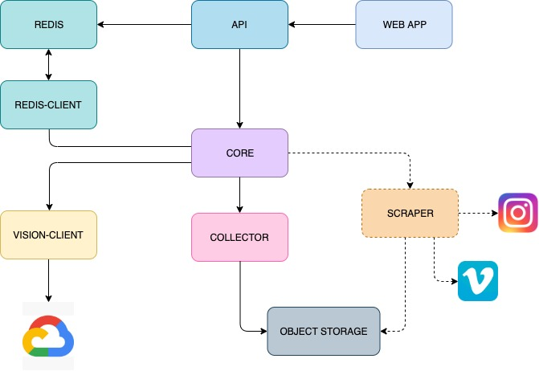

# Picture_dictionnary

This project is search engine of picture and video for mood board
The goal is to labelise pictures from choosen source download and reference them to be able to retrieve interesting data by word or mood

## Architecture

### Code Architecture

This projects try to create module that can be changed easily for another solution
It's means that every modules has to use or translate his data by core(lib) data structure
At the end the goal is that every module could run like micro services
For each module:

*  Domain part is placed inside \<subproject\>/service
*  Dependency injection is done inside \<subproject\>/cmd/main.go
*  Mostly, the other directories inside subprojects are adapters

Picture Dictionnary follows the principle of **Monorepo** strategy, this means that all (micro)services running in production should be inside this repo Except Api and Redis Datastore. Let's take a look of each folder:

* In **api**, we have the service that allows us to make request to the picture-dictionnary
This is for now the only service to be independent

* In **vision-client**, we have an dev client that retreive all images informations request to google-cloud-vision

* In **redis-client**, we have an dev client that post and get all informations from redis datastore

* In **core**, there is useful structs or constant useful and shared between subproject

* In **scraper**, not implement yet but has to scrap picture and video from differents sources. So they will be surely multiple scraper

**Docker** Have to be remade for now it's just launch redis datastore and api

### General architecture overview

## Getting Started

### Instructions to launch Redis and Api

In order to bring up:
- Use `docker-compose build` to build api
- Use `docker-compose up` to see the logs of all the containers
- Use `docker-compose up -d` if you want it to run in the foreground
- Checking the installation with `redis-cli ping`
- Help `redis-cli --help`
- Launch redis-shell `docker exec -it redis redis-cli`
- See database `CONFIG GET databases`
- See keyspace `INFO keyspace`
- Visit http://localhost:8080/ to check api
- In order to clean up the cluster, use `docker-compose down`

## API

- GET /pulse — heartbeat check if our API is online
- GET /pictures(#get-pictures) — fetch all pictures from the database (Not implement yet)
- GET /picture/[tag] — fetch pictures by tag from the database
- GET /tags - fetch all labels and objects from database
- GET /labels - fetch all labels from database
- GET /objects - fetch all objects from database

## Redis Structure and API

- See README.md inside Api directory

## To do

- create logger error - api done - service todo

* Check
    - check picture size
    - check video size
    - check format picture : 
    - and video : .MOV, .MPEG4, .MP4 et .AVI
    - encodage base64 ?

* Client api vision
    - finish implement video request
    - see how it's for video
    - finish test implementation

* Api Go
    - implement test
    - try picture by label request
    - change implementation Api has to request from Core/lib

* Object Storage
    - check documentation
    - choose objectstorage service

* Web app
    - ???

* Create and Dockerise analyzer
    - Detection
    - Indexation
    - Search indexation

* Collector
    - implement from directory
    - implement scrapping data